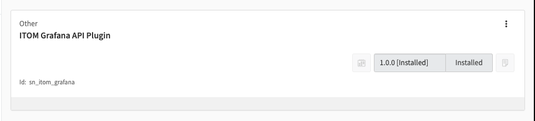

# REST API for ITOM Grafana Plugin
This repostory contains REST APIs used by the [ServiceNow ITOM Grafana Plugin](https://github.com/ServiceNow/itom-grafana-plugin)
The APIs can be installed directly from this source repo to global scope by pointing to the master branch of this repo.
Open API (swagger) docs are [here](http://ec2-34-230-5-99.compute-1.amazonaws.com/).

The ITOM Grafana plugin repo contains two seprate plugins. A [UI/dashboards plugin](https://github.com/ServiceNow/itom-grafana-plugin/tree/main/dashboards) that runs in the browser and a [compiled data source plugin](https://github.com/ServiceNow/itom-grafana-plugin/tree/main/servicenow-optimiz-plugin) that run in the Grafana server. The source for the data source plugin lives in: https://github.com/ServiceNow/servicenow-grafana-datasource

To build this as a scoped app with scope `sn_itom_grafana` switch to the [lightstep branch](https://github.com/ServiceNow/Grafana-Plugin-ServiceNow/tree/lightstep) and execute `mvn clean install`. This will create a 
`.zip` file in the `target` folder. The `.zip` file can be installed using the `Install File` feature in `maint` mode as shown below.

 

The installed app will look like this:

