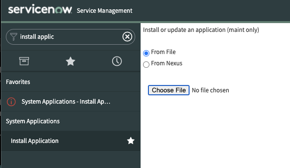
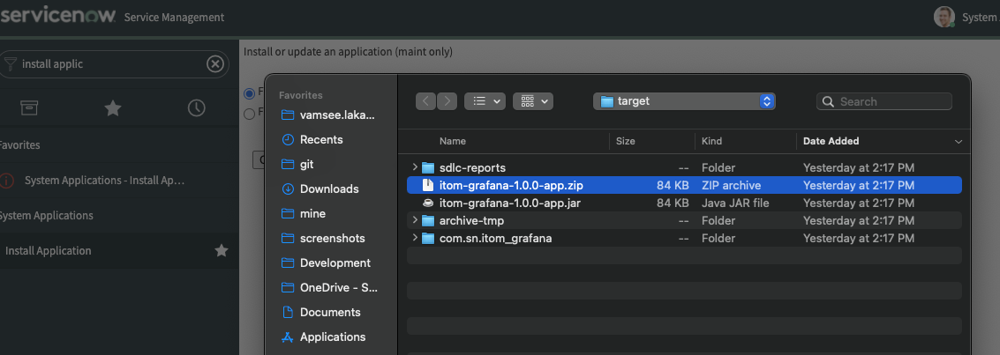

# REST API for ITOM Grafana Plugin
This repostory contains REST APIs used by the [ServiceNow ITOM Grafana Data Source Plugin](https://grafana.com/blog/2020/02/03/introducing-the-new-servicenow-plugin-for-grafana/).
The APIs can be installed directly from this source repo to global scope by pointing to the master branch of this repo. 

To build this as a scoped app with scope `sn_itom_grafana` switch to the [maven branch](https://github.com/ServiceNow/Grafana-Plugin-ServiceNow/tree/maven) and execute `mvn clean install`. This will create a 
`.zip` file in the `target` folder. The `.zip` file can be installed using the `Install File` feature in `maint` mode as shown below.

 
